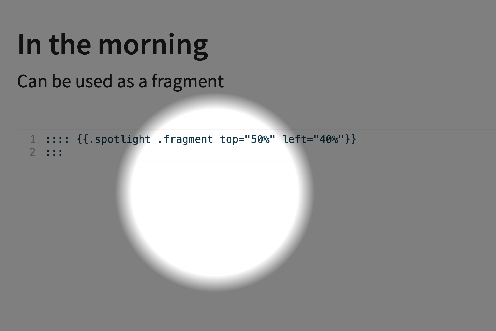

# Spotlight Extension For Quarto

Add a simple spotlight feature to slides.



## Installing

```bash
quarto add emilhvitfeldt/quarto-revealjs-spotlight
```

This will install the extension under the `_extensions` subdirectory.
If you're using version control, you will want to check in this directory.

## Using

Add the following in any slide to put a spotlight on that location. Adding the `.fragment` class will let it work as a fragment.

`````markdown
:::: {.spotlight top="20%" left="15%"}
:::
`````

## Example

Here is the source code for a minimal example: [example.qmd](example.qmd).

